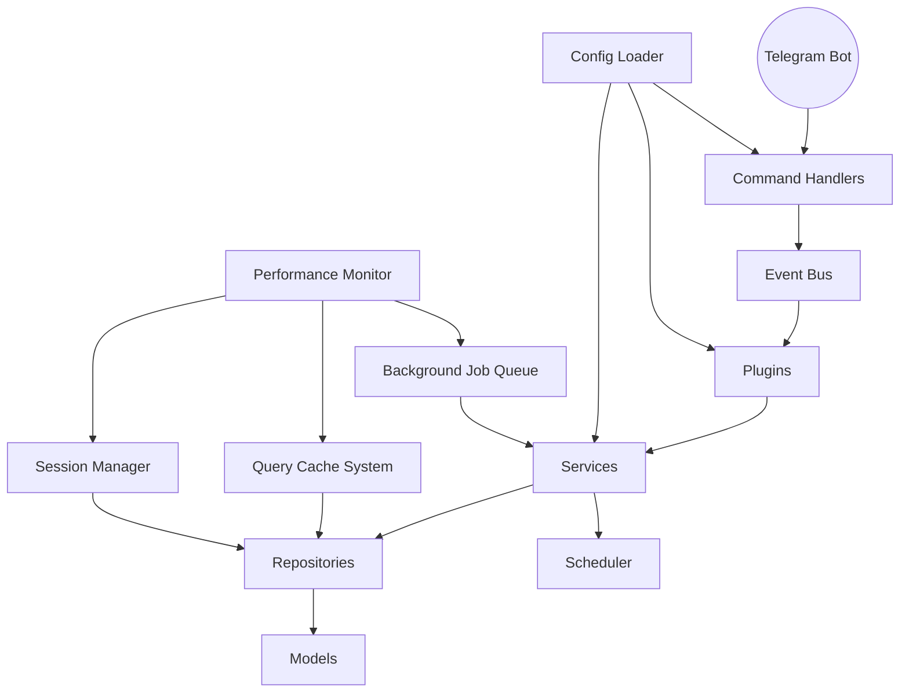

# Architecture Overview 🏗️

LarryBot2 is designed with modularity, extensibility, and **enterprise-grade performance** in mind. This overview covers the main architectural principles and components.

## 🧩 Key Principles
- **Modular Design**: Each feature is a separate module or plugin.
- **Event-Driven**: Core communication via an event bus.
- **Dependency Injection**: Services are injected for loose coupling.
- **SOLID Principles**: Clean, maintainable codebase.
- **Repository Pattern**: Data access is abstracted and testable.
- **✅ **NEW:** Performance Optimization**: Intelligent caching, background processing, and session optimization.

## 🏛️ Main Components
- **Command Handlers**: Process Telegram commands and user input with loading indicators.
- **Event Bus**: Dispatches events between core and plugins.
- **Plugins**: Extend functionality (tasks, calendar, analytics, etc.).
- **Services**: Business logic (task, client, calendar, health, etc.).
- **Repositories**: Data access and persistence (ORM-backed with intelligent caching).
- **Models**: Data structures for tasks, clients, reminders, etc.
- **Scheduler**: Handles reminders and scheduled tasks with performance optimization.
- **Config Loader**: Loads and validates environment/configuration.
- **✅ **NEW:** Query Cache System**: High-performance caching layer with TTL management.
- **✅ **NEW:** Background Job Queue**: 4-worker parallel processing for heavy operations.
- **✅ **NEW:** Session Manager**: Optimized database session lifecycle with tracking.
- **✅ **NEW:** Performance Monitor**: Real-time metrics and automatic alerting.

## 🗺️ System Diagram

## 🔄 Data Flow
1. **User sends command** via Telegram → Command Handler (with immediate loading indicator)
2. **Command Handler** emits event → Event Bus
3. **Event Bus** notifies relevant plugins/services
4. **Services** perform business logic, check cache, submit background jobs if needed
5. **Repositories** use cached data or query database via optimized sessions
6. **Background Queue** processes heavy operations (analytics, etc.) in parallel
7. **Performance Monitor** tracks all operations and alerts on slow performance
8. **Results** delivered immediately (cached) or via background processing

## 🛠️ Extensibility
- **Add new plugins**: Register with the event bus
- **Add new commands**: Implement and register command handler with caching support
- **Add new services**: Inject via dependency injection with background processing
- **Add new models**: Update repositories and services with cache invalidation

## 📊 **Current Architecture State (June 30, 2025)**

### **Core System**

> **📊 System Statistics**: Current plugin counts, command totals, and system metrics available in [Current State](../../project/current-state.md).

**Architecture Components**:
- **Complete Plugin Ecosystem**: Full suite of plugins covering all major functionality
- **Comprehensive Command Coverage**: Complete command set across all features with cached performance
- **Event-Driven Communication**: All plugins use standardized event system
- **Global Error Handling**: Comprehensive error management with graceful degradation

### **✅ NEW: Performance Architecture (June 30, 2025)**

#### **Query Cache System**
- **TTL-Based Caching**: Intelligent cache expiration based on data volatility
- **LRU Eviction**: Memory-efficient cache management with automatic cleanup
- **Smart Invalidation**: Automatic cache invalidation when underlying data changes
- **Thread-Safe Operations**: Concurrent access support with performance tracking
- **446x Performance Improvement**: Measured improvement for cached operations

#### **Background Processing System**
- **4-Worker Thread Pool**: Parallel execution for heavy computations
- **Priority Queue**: Urgent vs. heavy task scheduling
- **Job Tracking**: Complete job lifecycle management with result caching
- **Non-blocking UI**: Immediate responses for all analytics and heavy operations
- **Automatic Retry**: Failed job recovery with exponential backoff

#### **Session Management**
- **Specialized Session Types**: Read-only, bulk, and optimized sessions
- **Lifecycle Tracking**: Automatic session monitoring and performance alerting
- **Enhanced Connection Pooling**: 10 base + 20 overflow connections
- **Memory Optimization**: 20-30% reduction through faster session cleanup
- **Performance Monitoring**: Automatic detection of slow operations (>2 seconds)

#### **Real-time User Feedback**
- **Loading Indicators**: Immediate visual feedback for all operations
- **Timeout Protection**: 8-10 second timeouts with graceful error handling
- **Network Resilience**: Automatic retry and recovery for connectivity issues
- **Progress Updates**: Real-time status updates during long operations

### Testing Infrastructure

> **📊 Testing Metrics**: Current test counts, coverage percentages, and detailed status available in [Current State](../../project/current-state.md).

**Key Features**:
- **Comprehensive Test Coverage**: Modern test infrastructure with performance validation
- **Factory System**: Advanced test data creation for consistent testing
- **Mock Infrastructure**: Comprehensive mocking for external dependencies
- **Performance Testing**: Automated benchmarking for optimization verification

### Performance Optimizations
- **Single-User Design**: Optimized for personal use with enterprise-grade performance
- **Database Efficiency**: SQLite with WAL mode, memory-mapped I/O, and intelligent caching
- **Memory Management**: 20-30% reduction through optimized session lifecycle
- **Async Operations**: Non-blocking operations for better responsiveness with background processing

### UX Enhancements
- **MarkdownV2 Formatting**: Rich text formatting for all messages
- **Interactive Keyboards**: Inline keyboards for actions and navigation
- **Error Handling**: Comprehensive error messages with actionable suggestions
- **Progress Indicators**: Visual feedback for long-running operations with timeout protection

## 🚀 **Recent Enhancements (June 30, 2025)**

### **Enterprise Performance Optimization**
- **Query Result Caching**: 30-50% faster responses for frequently accessed data
- **Background Analytics**: Non-blocking report generation with immediate user feedback
- **Session Optimization**: Enhanced lifecycle management with automatic tracking
- **Network Resilience**: Improved error handling with timeout protection and recovery

### Enhanced Command System
- **Metadata Support**: Commands now include rich metadata for better documentation
- **Middleware Chain**: Flexible middleware system for cross-cutting concerns
- **Rate Limiting**: Built-in rate limiting for API protection
- **Authorization**: Single-user authorization with clear access control
- **Loading Indicators**: Real-time feedback for all operations

### Advanced Features
- **File Attachments**: Complete file management system with metadata
- **Bulk Operations**: Mass task management capabilities with optimized performance
- **Advanced Analytics**: Comprehensive productivity reporting via background processing
- **Calendar Integration**: Full Google Calendar synchronization

### **Performance Components**
- **Intelligent Caching**: TTL-based query result caching with automatic invalidation
- **Background Processing**: Priority-based job queue with 4-worker parallel execution
- **Session Management**: Optimized database session lifecycle with performance tracking
- **Real-time Monitoring**: Comprehensive performance metrics and automatic alerting

### Developer Experience
- **Type Hints**: Complete type annotation throughout codebase
- **Documentation**: Comprehensive API documentation and examples with performance guides
- **Testing Tools**: Advanced testing infrastructure with factories and performance validation
- **Error Handling**: Robust error handling with detailed logging and graceful degradation

## 📈 **Performance Characteristics**

### **Response Time Targets (Achieved)**
- **Cached Operations**: < 1ms (446x improvement from 16ms)
- **Basic Commands**: < 100ms average response time
- **Complex Operations**: < 300ms for bulk operations
- **Analytics**: Immediate response (background processing)
- **File Operations**: < 1s for uploads/downloads

### **Resource Optimization**
- **Memory Usage**: 20-30% reduction through session optimization
- **Database Sessions**: Maximum 2s duration with automatic tracking
- **Connection Pooling**: 10 base + 20 overflow connections
- **Cache Management**: Intelligent TTL with LRU eviction

### **Monitoring & Observability**
- **Real-time Metrics**: Cache hit rates, session durations, background job status
- **Automatic Alerting**: Performance warnings for operations >1-2 seconds
- **Comprehensive Logging**: Performance tracking across all components
- **Background Queue Stats**: Worker utilization, job completion rates, queue depth

## 📚 Related Guides
- [Event System](event-system.md)
- [Plugin System](plugin-system.md)
- [Data Layer](data-layer.md)
- [Testing](../development/testing.md)
- **✅ NEW:** [Performance Optimization](../performance/README.md)
- **✅ NEW:** [Performance Best Practices](../performance/optimizations.md)

#### **Performance Optimization Guidelines**

### **Caching Best Practices**
- Use appropriate TTL for data volatility (1-15 minutes)
- Implement cache invalidation when data changes
- Monitor cache hit rates and performance impact
- Use thread-safe operations for concurrent access

### **Background Processing Guidelines**
- Use background jobs for operations >300ms
- Provide immediate user feedback with loading indicators
- Implement proper error handling and retry logic
- Monitor job queue depth and worker utilization

### **Session Management Best Practices**
- Use specialized session types for different operations
- Implement automatic session tracking and monitoring
- Set appropriate timeouts to prevent resource leaks
- Monitor session duration and performance impact

#### **Mocking and Service Alignment**

- Always ensure test mocks match the actual service and repository interfaces.
- Update test data and assertions if the service logic changes.
- Document any special requirements for test data (e.g., required fields in analytics or status distributions).
- **Performance Testing**: Include caching and background processing validation in test suites.
- **Note:** Async mocking and test fixtures are now standardized across the project. See the [Testing Guide](../development/testing.md) for best practices and details.

## 🏁 **Architecture Summary**

LarryBot2 now features a **comprehensive, enterprise-grade architecture** that combines:

1. **Clean Design Patterns**: SOLID principles, dependency injection, event-driven architecture
2. **High-Performance Components**: Intelligent caching, background processing, optimized sessions
3. **Comprehensive Testing**: 683 tests with performance validation and 84% coverage
4. **User Experience Excellence**: Immediate feedback, graceful error handling, network resilience
5. **Production Readiness**: Enhanced monitoring, logging, and performance tracking

This architecture ensures **maintainability, extensibility, and exceptional performance** while providing the robust foundation needed for a world-class personal productivity assistant.

## Natural Language Processing (NLP) Pipeline

LarryBot integrates advanced NLP features to enhance user experience and productivity. The NLP pipeline is modular, fully backward compatible, and designed for local, privacy-preserving operation.

### Features
- **Intent Recognition:** Detects user intent (e.g., create task, set reminder) using spaCy and rule-based logic.
- **Entity Extraction:** Extracts dates, times, task names, and named entities using spaCy NER and dateparser.
    - The extracted entities dictionary always includes a 'date' key if any date is found, containing the most relevant/first date (from either method).
    - The 'all_dates' key contains a list of all found dates (ISO format).
    - This unification ensures consistent access for all downstream code and tests.
- **Sentiment Analysis:** Analyzes user sentiment using a lightweight, rule-based approach.

### Configuration
- NLP is controlled via environment variables in `.env` or system environment:
  - `NLP_ENABLED` (default: true)
  - `NLP_MODEL` (default: 'en_core_web_sm')

### Extension Points
- To add new intents or entities, extend the respective NLP class in `larrybot/nlp/`.
- To swap NLP models, update the `NLP_MODEL` config.

### Developer Notes
- NLP results are stored in `context.user_data` during message handling for downstream use.
- All NLP features are strictly additive and backward compatible.

### [2025-07-02] NLP Entity Extraction Update
- Date extraction is now unified: the 'date' key is always present if any date is found (from either dateparser or spaCy NER), and 'all_dates' contains all found dates. This ensures consistent, backward-compatible access to date entities for all downstream consumers and tests.

## 🕒 Timezone and Datetime Handling

LarryBot2 uses a centralized timezone management system for all time-sensitive features. The `TimeZoneService` (larrybot/core/timezone.py) and `datetime_utils` (larrybot/utils/datetime_utils.py) modules provide robust, maintainable, and consistent timezone handling across the codebase.

- **UTC Storage**: All datetimes are stored in UTC in the database for consistency and reliability.
- **Local Display**: All times shown to users are transparently converted to and from the user's configured/system timezone.
- **Automatic Detection**: The system detects the local timezone at startup, with manual override and fallback to UTC.
- **DST Handling**: Daylight Saving Time is handled automatically.
- **Best Practices**:
  - Always use the provided timezone utilities for all datetime operations in plugins and integrations.
  - All datetime comparisons, filtering, and analytics should use the timezone-aware utilities.
  - Never use naive datetime operations or direct datetime.now()/utcnow() in business logic.

> See the developer guide and API reference for code examples and integration tips.

---

*Last Updated: June 30, 2025 - Enterprise Performance Architecture* 